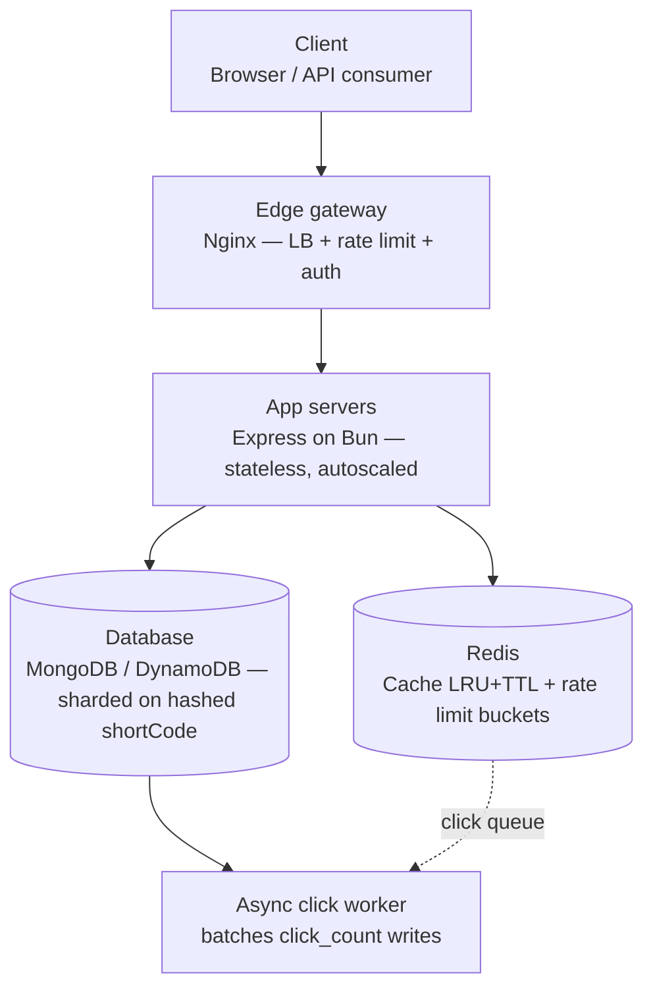

# URL shortener — production system design

A production-grade URL shortener built to demonstrate distributed systems
fundamentals: collision-free ID generation, sharded storage, cache-aside
reads, and a token-bucket rate limiter — not just a CRUD app with a redirect.

<p align="center">
  
</p>

---

## Architecture



**Request flow (redirect path):**

1. Client → Nginx (TLS termination, load balancing across app replicas)
2. Nginx → Express app server (round-robin / least-conn)
3. App server → Redis: token-bucket check (atomic Lua script)
4. App server → Redis: `GET cache:{code}`
   - **Hit** → 302 redirect immediately, click event pushed to a queue
   - **Miss** → query DB by `shortCode` → `SET cache:{code}` with TTL → 302 redirect
5. Async worker drains the click queue in batches, increments `clickCount` in
   the DB — redirects never wait on that write

---

## Why each piece is what it is

### Short code generation — Snowflake + Base62
Random Base62 needs a collision check on every write; that doesn't scale.
Instead: a Snowflake-style 64-bit ID (`timestamp | workerId | sequence`) is
generated **in-process, with zero network calls and zero coordination**
between app servers, then Base62-encoded into the short code. Structurally
collision-free — no retries, no DB round trip to check uniqueness.
See `src/lib/snowflake.ts` / `src/lib/base62.ts`.

> Note: the encoded code is **10-11 characters**, not the "classic" 7 —
> a 63-bit ID needs `log(2^63)/log(62) ≈ 10.6` Base62 digits. Still a normal
> short-URL length.

### Database — sharded on hashed `shortCode`
Access pattern is a pure key-value point lookup, read-heavy (100-1000:1
read:write). Sharding on a **hash** of `shortCode` (not a range key like
`createdAt`) spreads writes evenly and avoids hot-shard problems. Currently
implemented on MongoDB (`hashed` shard key) for local dev speed; DynamoDB is
the recommended production target since it auto-splits hot partitions with
no manual shard management. Only `db/client.ts` and `db/urlRepository.ts`
would change to migrate — nothing else in the app touches the DB directly.

### Redis — two jobs, one instance
- **Cache**: cache-aside pattern, `allkeys-lru` eviction, sliding TTL (touched
  on every read so hot links never expire, cold ones fall out naturally).
- **Rate limiting**: atomic token-bucket via a Lua script (`EVAL`) so
  check-and-decrement never races across concurrent requests.

### Rate limiting — token bucket
Allows short bursts while enforcing a steady average rate (same family of
algorithm Stripe/GitHub/AWS API Gateway use). Tiered by auth status:

| Tier | Create | Read (redirect) |
|---|---|---|
| Anonymous | 10/min | 100/min |
| Free | 30/min | 1,000/min |
| Pro | 300/min | 10,000/min |

### Redirect status code — 302, not 301
301 (permanent) gets cached by browsers/CDNs — you lose the ability to track
clicks or change the destination later. 302 keeps it live.

---

## Tech stack

- **Runtime**: Bun
- **Framework**: Express
- **Cache / rate limiter**: Redis (ioredis)
- **Database**: MongoDB (dev) → DynamoDB (production target)
- **Auth**: Supabase (email/password + Google OAuth), JWT verified locally
- **Containerization**: Docker + docker-compose
- **Reverse proxy / LB**: Nginx

---

## Project structure

```
url-shortener/
├── src/
│   ├── server.ts                 # Express app entry point
│   ├── config/env.ts             # typed, validated env config
│   ├── lib/
│   │   ├── snowflake.ts          # distributed ID generator
│   │   ├── base62.ts             # bigint <-> Base62 codec
│   │   └── redis.ts              # Redis client + cache helpers
│   ├── middleware/
│   │   ├── auth.ts               # Supabase JWT verification
│   │   └── rateLimiter.ts        # token bucket middleware
│   ├── db/
│   │   ├── client.ts             # DB connection
│   │   └── urlRepository.ts      # all raw DB queries live here
│   ├── routes/
│   │   ├── urls.ts               # create/list/get/delete/stats
│   │   └── redirect.ts           # GET /:code
│   ├── services/urlService.ts    # orchestration + cache-aside logic
│   └── types/                    # shared interfaces
├── worker/clickWorker.ts         # async click count aggregator
├── nginx.conf
├── Dockerfile
├── docker-compose.yml
└── .env.example
```

---

## API routes

```
POST   /api/v1/urls              create short URL
GET    /api/v1/urls              list current user's URLs (auth required)
GET    /api/v1/urls/:code        get one URL's details
DELETE /api/v1/urls/:code        delete (auth required, owner-only)
GET    /api/v1/urls/:code/stats  click analytics
GET    /:code                    302 redirect
GET    /health                   health check
```

---

## Running locally

```bash
cp .env.example .env      # fill in SUPABASE_JWT_SECRET
docker compose up --build
```

Starts: app, click-worker, Redis (LRU-configured), MongoDB, Nginx.

```bash
curl -X POST localhost/api/v1/urls \
  -H "Content-Type: application/json" \
  -d '{"longUrl":"https://example.com"}'
```

---

## Environment variables

| Variable | Purpose |
|---|---|
| `PORT` | App server port |
| `WORKER_ID` | Snowflake worker id (0-1023), must be unique per instance |
| `BASE_URL` | Used to build the returned `shortUrl` |
| `REDIS_URL` | Redis connection string |
| `MONGO_URL` / `MONGO_DB_NAME` | Mongo connection |
| `SUPABASE_JWT_SECRET` | Verifies auth tokens locally |
| `RATE_LIMIT_*` | Per-tier, per-bucket token bucket capacity |

`.env` is for **local development only** — real secrets are gitignored and
never committed. In production, values are injected by the deployment
platform (ECS task definition, Secrets Manager, etc.), not shipped as a file
inside the container image.

---

## What's real vs. what's a next step

- Fully implemented and typechecked: ID generation, Base62, cache-aside,
  token-bucket limiter, async click worker, Express routing.
- Mongo has the unique index + hashed-shard-key command ready; sharding
  itself only activates on a real Mongo cluster.
- Auth verifies JWTs locally — you still need a real Supabase project and
  frontend signup/OAuth flow.
- No automated tests included yet.