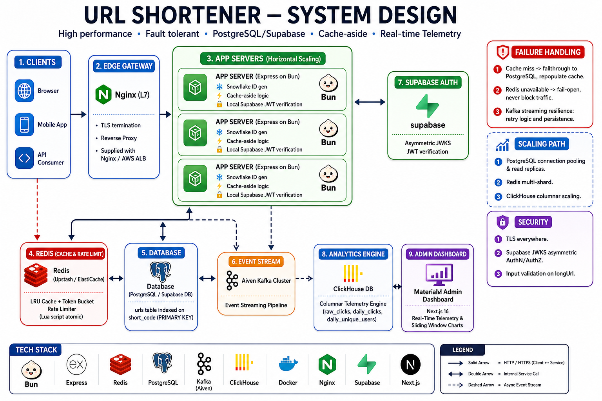
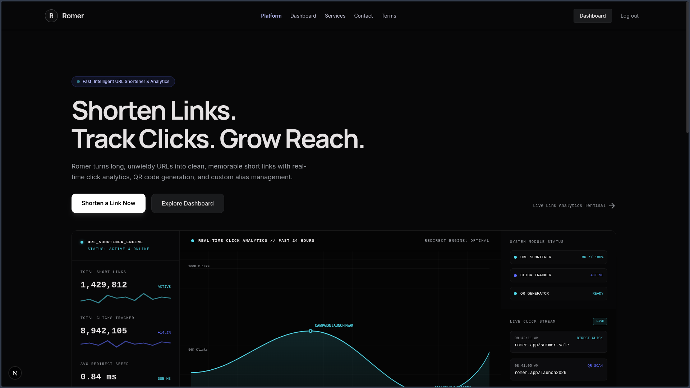
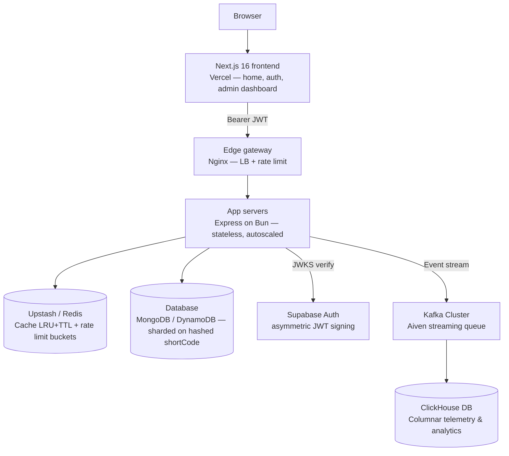

# Romer — URL shortener SaaS with production system design

A URL shortener built to demonstrate distributed systems fundamentals —
collision-free ID generation, sharded storage, cache-aside reads, Kafka stream processing, ClickHouse telemetry analytics, and a token-bucket rate limiter — wrapped in a real SaaS shell: auth, an enterprise MaterialM admin dashboard, and a public marketing site.

<p align="center">
  
</p>
<p align="center">
  
</p>

---

## Architecture



**Request flow (redirect path):**

1. Client → Nginx (TLS termination, load balancing across app replicas)
2. Nginx → Express app server (round-robin / least-conn)
3. App server → Redis: token-bucket check (atomic Lua script)
4. App server → Redis: `GET cache:{code}`
   - **Hit** → 302 redirect immediately, click event dispatched asynchronously to Kafka stream
   - **Miss** → query DB by `shortCode` → `SET cache:{code}` with TTL → 302 redirect
5. Kafka consumer processes click telemetry in near real-time, ingesting events into **ClickHouse** columnar tables (`raw_clicks`, `daily_clicks`, `daily_unique_users`) — redirects never wait on analytics writes.

**Request flow (authenticated dashboard actions):**

1. User signs in via Supabase Auth (email/password) on the Next.js frontend
2. Frontend attaches the Supabase-issued JWT as `Authorization: Bearer <token>`
   on every API call
3. Backend verifies the token against Supabase's **JWKS endpoint** (asymmetric,
   no shared secret) via `jose`'s `createRemoteJWKSet` — no round trip to
   Supabase's API, keys are cached and auto-refreshed on rotation
4. Next.js middleware protects `/dashboard/*` and `/admin/*` server-side — an unauthenticated
   request never reaches the page, it's redirected before any HTML renders

---

## Why each piece is what it is

### Short code generation — Snowflake + Base62

Random Base62 needs a collision check on every write; that doesn't scale.
Instead: a Snowflake-style 64-bit ID (`timestamp | workerId | sequence`) is
generated **in-process, with zero network calls and zero coordination**
between app servers, then Base62-encoded into the short code. Structurally
collision-free — no retries, no DB round trip to check uniqueness.
See `apps/backend/src/lib/snowflake.ts` / `base62.ts`.

> Note: the encoded code is **10-11 characters**, not the "classic" 7 —
> a 63-bit ID needs `log(2^63)/log(62) ≈ 10.6` Base62 digits. Still a normal
> short-URL length.

### Real-Time Telemetry & Analytics — Kafka + ClickHouse

High-volume redirect clicks generate massive event volumes. Instead of hammering transactional databases (MongoDB/DynamoDB) with OLAP aggregation queries:
- **Kafka**: Decouples click event ingestion from redirect response loops.
- **ClickHouse**: Columnar database storing raw event logs (`raw_clicks`) and materialized daily rollups (`daily_clicks`, `daily_unique_users`) for sub-second analytical dashboard queries.

### Database — sharded on hashed `shortCode`

Access pattern is a pure key-value point lookup, read-heavy (100-1000:1
read:write). Sharding on a **hash** of `shortCode` (not a range key like
`createdAt`) spreads writes evenly and avoids hot-shard problems. Currently
implemented on MongoDB (`hashed` shard key) for local dev speed; DynamoDB is
the recommended production target since it auto-splits hot partitions with
no manual shard management. Only `db/client.ts` and `db/urlRepository.ts`
would change to migrate — nothing else in the app touches the DB directly.

### Redis — two jobs, one instance

- **Cache**: cache-aside pattern, `allkeys-lru` eviction, sliding TTL (touched
  on every read so hot links never expire, cold ones fall out naturally).
- **Rate limiting**: atomic token-bucket via a Lua script (`EVAL`) so
  check-and-decrement never races across concurrent requests.

### Rate limiting — token bucket

Allows short bursts while enforcing a steady average rate (same family of
algorithm Stripe/GitHub/AWS API Gateway use). Tiered by auth status:

| Tier      | Create  | Read (redirect) |
| --------- | ------- | --------------- |
| Anonymous | 10/min  | 100/min         |
| Free      | 30/min  | 1,000/min       |
| Pro       | 300/min | 10,000/min      |

### MaterialM Design System & Enterprise Admin Console

The administration and analytics platform adheres to the **MaterialM Design System**:
- **Dual Navigation**: Mini icon navigation bar paired with a slide-toggle expandable navigation drawer.
- **Context-Aware Active States**: Strict single-route highlighting across Analytics, eCommerce, Top URLs, Realtime Telemetry, and Landing Page Studio.
- **Interactive Header Modals**: Flyout modals for Notifications (with live badge counts), Messages/Inbox, Language selection (🇬🇧 English, 🇨🇳 中文, 🇫🇷 Français, 🇸🇦 عربي), and User Profile.
- **Dynamic Personalization**: User greeting dynamically parsed from authenticated Supabase user email handles.

---

## Tech stack

**Backend**

- Runtime: Bun / Node.js · Framework: Express
- Cache / rate limiter: Redis (Upstash / ioredis)
- Telemetry & Event Streaming: Kafka (Aiven) + ClickHouse
- Database: MongoDB (dev) → DynamoDB (production target)
- Auth verification: `jose` (JWKS, asymmetric)
- Containerization: Docker + docker-compose
- Reverse proxy / LB: Nginx

**Frontend**

- Framework: Next.js 16 (App Router, TypeScript)
- UI & Styling: MaterialM Design Tokens, Tailwind CSS, Lucide Icons, Recharts
- Auth: Supabase (`@supabase/ssr`) — email/password, session cookies
- Route protection: Next.js middleware, server-side session check
- Hosting: Vercel

---

## Project structure

```
url-shortner/
├── apps/
│   ├── backend/
│   │   ├── src/
│   │   │   ├── server.ts                 # Express app entry point
│   │   │   ├── config/env.ts             # typed, validated env config
│   │   │   ├── lib/
│   │   │   │   ├── snowflake.ts          # distributed ID generator
│   │   │   │   ├── base62.ts             # bigint <-> Base62 codec
│   │   │   │   ├── redis.ts              # Redis client + cache helpers
│   │   │   │   └── clickhouse.ts         # ClickHouse analytics client
│   │   │   ├── middleware/
│   │   │   │   ├── auth.ts               # Supabase JWT verification (JWKS)
│   │   │   │   └── rateLimiter.ts        # token bucket middleware
│   │   │   ├── db/
│   │   │   │   ├── client.ts             # DB connection
│   │   │   │   └── urlRepository.ts      # all raw DB queries live here
│   │   │   ├── routes/
│   │   │   │   ├── urls.routes.ts        # create/list/get/delete/stats
│   │   │   │   ├── redirect.routes.ts    # GET /:code
│   │   │   │   └── adminAnalytics.routes.ts # ClickHouse telemetry endpoints
│   │   │   ├── services/
│   │   │   │   ├── urlService.ts         # orchestration + cache-aside logic
│   │   │   │   └── adminAnalyticsService.ts # ClickHouse query aggregation
│   │   │   └── types/                    # shared interfaces
│   │   ├── worker/clickWorker.ts         # async Kafka event consumer
│   │   └── Dockerfile
│   │
│   └── frontend/
│       ├── app/
│       │   ├── page.tsx                  # public landing page
│       │   ├── login/page.tsx            # sign in / sign up
│       │   ├── contact/, services/, terms/
│       │   ├── dashboard/                # standard user dashboard
│       │   │   ├── layout.tsx            # protected user shell
│       │   │   ├── page.tsx              # URL management
│       │   │   └── stats/page.tsx        # click analytics
│       │   └── admin/                    # MaterialM Admin Dashboard
│       │       ├── layout.tsx            # MaterialM shell (slide sidebar, header modals)
│       │       ├── page.tsx              # Overview & ClickHouse platform stats
│       │       ├── ecommerce/page.tsx    # eCommerce demo dashboard
│       │       ├── landingpage/page.tsx  # Landing page studio
│       │       ├── realtime/page.tsx     # 5-min sliding window telemetry stream
│       │       └── top-urls/page.tsx     # High-traffic URL leaderboards
│       ├── lib/
│       │   ├── supabase/client.ts        # browser Supabase client
│       │   ├── supabase/server.ts        # server Supabase client
│       │   └── api.ts                    # backend fetch wrapper (Bearer auth)
│       └── middleware.ts                 # server-side route protection
│
├── nginx.conf
├── docker-compose.yml
└── .env.example
```

---

## API routes

```
POST   /api/v1/urls                   create short URL
GET    /api/v1/urls                   list current user's URLs (auth required)
GET    /api/v1/urls/:code             get one URL's details
DELETE /api/v1/urls/:code             delete (auth required, owner-only)
GET    /api/v1/urls/:code/stats       click analytics
GET    /api/admin/analytics/overview  ClickHouse platform summary stats
GET    /api/admin/analytics/top-urls  ClickHouse top performing URLs
GET    /api/admin/analytics/realtime  ClickHouse 5-minute sliding window stream
GET    /:code                         302 redirect
GET    /health                        health check
```

---

## Running locally

**Backend + Redis + Mongo (via Docker):**

```bash
cd apps/backend
cp .env.example .env      # fill in SUPABASE_URL, MONGO_URL, CLICKHOUSE_URL, KAFKA_BROKERS
cd ../..
docker compose up --build
```

**Frontend:**

```bash
cd apps/frontend
cp .env.example .env.local   # fill in Supabase URL/key, NEXT_PUBLIC_API_URL
npm install
npm run dev
```

```bash
curl -X POST localhost:4000/api/v1/urls \
  -H "Content-Type: application/json" \
  -d '{"longUrl":"https://example.com"}'
```

---

## Environment variables

**Backend**

| Variable                      | Purpose                                                   |
| ----------------------------- | --------------------------------------------------------- |
| `PORT`                        | App server port                                           |
| `WORKER_ID`                   | Snowflake worker id (0-1023), must be unique per instance |
| `BASE_URL`                    | Used to build the returned `shortUrl`                     |
| `REDIS_URL`                   | Redis connection string (Upstash / Local)                 |
| `MONGO_URL` / `MONGO_DB_NAME` | Mongo connection                                          |
| `CLICKHOUSE_URL`              | ClickHouse connection endpoint                            |
| `KAFKA_BROKERS`               | Aiven / Local Kafka brokers                               |
| `SUPABASE_URL`                | Used to fetch Supabase's JWKS for token verification      |
| `RATE_LIMIT_*`                | Per-tier, per-bucket token bucket capacity                |

**Frontend**

| Variable                        | Purpose                  |
| ------------------------------- | ------------------------ |
| `NEXT_PUBLIC_SUPABASE_URL`      | Supabase project URL     |
| `NEXT_PUBLIC_SUPABASE_ANON_KEY` | Supabase publishable key |
| `NEXT_PUBLIC_API_URL`           | Backend base URL         |

`.env` / `.env.local` are for **local development only** — real secrets are
gitignored and never committed. In production, values are injected by the
deployment platform (Railway variables, Vercel environment settings), not
shipped as a file inside the container image.

---

## Deployment

- **Backend** → Railway (Docker, from `apps/backend`)
- **Frontend** → Vercel (root directory: `apps/frontend`)
- **Auth** → Supabase (managed)
- **Streaming & Analytics** → Aiven Kafka & ClickHouse Cloud
- **CORS** configured on the backend to allow only the deployed frontend origin

---

## What's real vs. what's a next step

- Fully implemented and typechecked: ID generation, Base62, cache-aside,
  token-bucket limiter, Kafka click event streaming, ClickHouse telemetry queries, MaterialM Admin Dashboard with real-time sliding windows, Express routing, JWKS auth verification, protected Next.js routes, full signup/login flow.
- Mongo has the unique index + hashed-shard-key command ready; sharding
  itself only activates on a real Mongo cluster.
- Automated end-to-end integration test suite.
- Billing/plans (free/pro tiers) are scaffolded in rate limiting but not
  yet wired to real subscription/payment logic.
